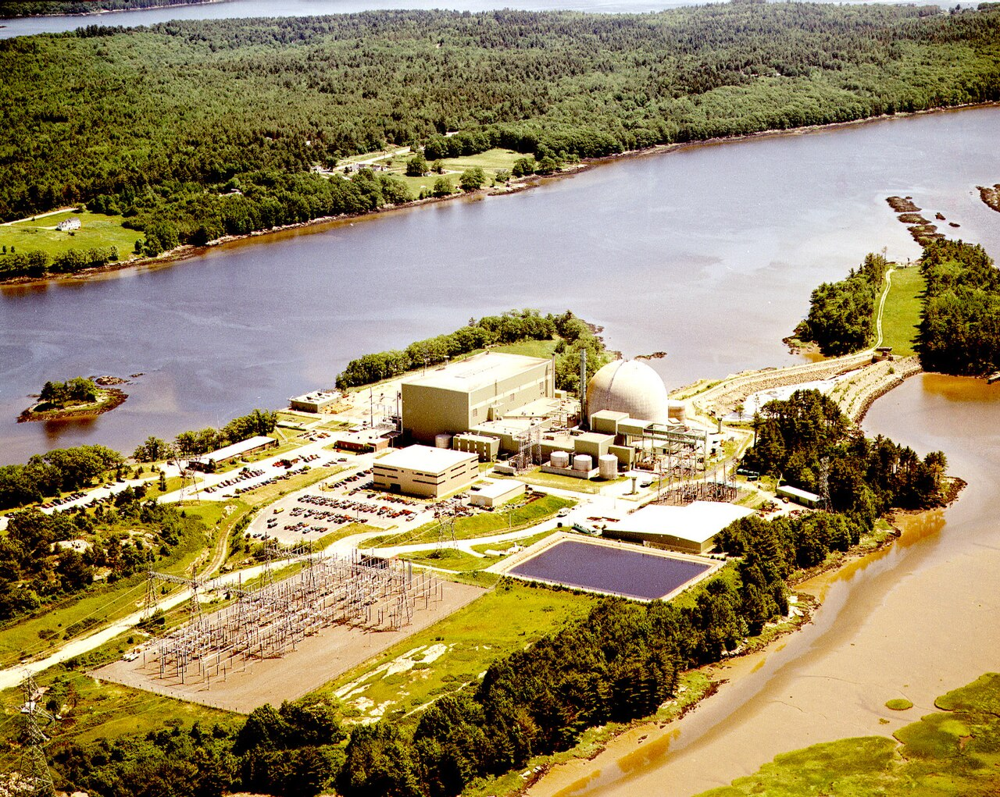

# Unit 3 Project, MATH283 Spring '26
### v.0.1

##### Site and code by C. Silver and P.Lee

This is the homepage for the U03 reactor cooling model project. Use the directory above to navigate to different sections of the project.

This repo will store python code and a modeling report for 
the unit 3 project.

